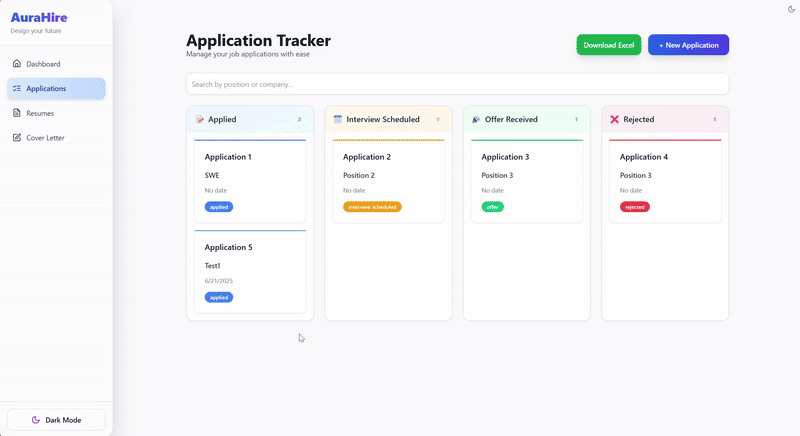
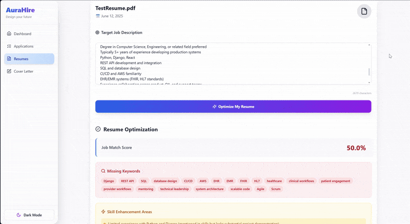

# 💼 AuraHire — AI-Powered Job Application Manager

     
      

AuraHire is an intelligent, full-stack web app that helps job seekers **streamline, track, and optimize** their job search with the power of AI and modern web technologies.

---
## 🖥️ Demo

### 🌙 Dark Mode & Application Tracker  
Easily toggle between light/dark mode and track your job applications in a kanban-style board.  


### 🧠 Resume Optimization  
Upload your resume and receive AI-powered insights to improve content, formatting, and keyword alignment.  


### 🖼️ Dashboard Screenshots  

| 🌞 Light Mode | 🌚 Dark Mode |
|--------------|-------------|
|  |  |

### ✍️ Cover Letter Generator  
Paste in a job description and let AI create a custom-tailored cover letter in seconds.  


---

## 💡 Motivation

Job hunting is exhausting — constantly tweaking resumes, rewriting cover letters, and tracking dozens of applications can quickly become overwhelming.

I created **AuraHire** to solve that frustration. It’s designed to **automate**, **optimize**, and **streamline** the entire job application process — all in one AI-powered tool. 🎯


---

## 🧾 Project Description

**AuraHire** is a modern, full-stack AI-powered platform built to make the job search process faster, smarter, and less stressful.

With an intuitive interface and powerful AI integrations, it helps job seekers:

- 🎯 **Visually track job applications** across stages like Applied, Interviewing, and Offer.
- ✍️ **Generate personalized cover letters** in seconds using your resume and job descriptions.
- 📊 **Get actionable resume feedback** powered by GeminiAI to improve your chances of getting hired.

---

### 🚀 Why I Built It

Job searching can feel like a second full-time job — endlessly rewriting resumes, crafting cover letters, and managing spreadsheets.

I built **AuraHire** to eliminate that grind. By combining AI with a clean, user-friendly workflow, AuraHire helps users focus on what really matters: landing the job.

It also gave me a chance to bring together everything I love — full-stack development, intuitive UI design, and real-world AI application.


---

## ✨ Key Features

| 🔧 Feature | 🚀 What It Does |
|-----------|-----------------|
| 📂 **Smart Application Tracker** | Visually organize and track each job application by stage: Applied, Interviewing, Offer, etc. |
| 📄 **Resume Management** | Upload, store, and reuse multiple resumes for different applications — all in one place. |
| 🧠 **AI Resume Analyzer** | Get intelligent, personalized suggestions using GeminiAI to improve your resume's impact. |
| ✍️ **AI Cover Letter Generator** | Instantly craft tailored cover letters by analyzing your resume and job description. |
| 🌙 **Dark Mode Support** | Full dark mode toggle for a better visual experience during long job search sessions. |
| ⚙️ **High-Performance Backend** | Powered by FastAPI, MongoDB, and Motor for fast, async data processing and scalability. |
| 🌐 **Modern Frontend Stack** | Built with React, Tailwind CSS, and Vite for a smooth, responsive, and blazing-fast UI. |


---

## 🛠 Installation

### 📁 1. Clone the Repository

```
git clone https://github.com/pritpagda/AuraHire.git
cd AuraHire
```

### 🧠 2. Backend Setup (FastAPI + MongoDB)
```
cd backend
python3 -m venv venv
venv\Scripts\activate
pip install -r requirements.txt
```

🔐 Create a .env file in the backend folder (based on .env.example) and add your environment variables:

```
MONGO_URI=your_mongodb_uri
GEMINI_API_KEY=your_gemini_api_key
DATABASE_NAME=your_database_name
```
🚀 Run the backend server:
```uvicorn main:app --reload```

### 💻 3. Set Up the Frontend (React + TailwindCSS + Vite)
```
cd ../frontend
npm install
npm start
```
### ✅ That’s it! Visit http://localhost:3000 to start using AuraHire.


---


## 🧪 How to Use AuraHire

Here’s how to get the most out of AuraHire after setup:

---

### 📂 1. Track Job Applications

Use the **Application Tracker** to:

- Add new job opportunities
- Move them through stages like `Applied`, `Interviewing`, `Offer`, and `Rejected`
- Visualize your progress and stay organized

---

### 📄 2. Upload Your Resume

- Upload your resume in `.pdf` or `.docx` format
- Store and manage multiple versions tailored to different job types

---

### 📋 3. Generate a Cover Letter (AI-Powered)

- Paste a **job description**
- Select one of your uploaded resumes
- Let AuraHire generate a **custom, tailored cover letter** in seconds ✨

---

### 🧠 4. Optimize Your Resume

- Select a resume
- Get real-time, **AI-driven feedback** using the Gemini API
- Receive suggestions to boost clarity, relevance, and ATS-friendliness

---

That's it! AuraHire helps you spend less time on paperwork and more time landing interviews. 🎯


---

## ⚙️ Tech Stack Overview

AuraHire is built using a modern, high-performance tech stack across all layers:

| 🧱 Layer      | 🔧 Technologies Used                                  |
|--------------|--------------------------------------------------------|
| 🌐 Frontend   | React, Tailwind CSS, Vite                             |
| ⚙️ Backend    | FastAPI, Pydantic, Uvicorn (ASGI server)              |
| 🗃️ Database   | MongoDB with Motor (async Python driver)              |
| 🤖 AI Layer   | Gemini API (Google Generative AI)                     |


---

## Credits

Built with ❤️ by **Prit Pagda**


---

## 📄 License

This project is licensed under the **MIT License** — see the [LICENSE](LICENSE) file for details.

---
